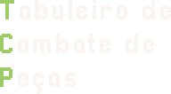

<p align="center" style="text-align:center;">


</p>


<p align="center" style="text-align:center;">

</p>


<p align="center" style="text-align:center;">


</p>

What is TCP?
===


TCP is an ***free open-source***, object-oriented implementation of the
traditional Chess, made for our final project for the "INF01120"
course. This game brings the full experience of playing chess with yout friends side-by-side to your computer.

<br>

https://github.com/user-attachments/assets/b3b70d38-4960-4ab5-a1b0-ba636fdcbb7c

<br>

## Installing and Playing TCP

TCP intends to be an beginner-friendly easy-to-play chess game. To starting playing, everything you need to do is clone this repository and build the game with the following commands based on your operation system:

#### Linux:
```bash
git clone https://github.com/SW-Engineering-Courses-Karina-Kohl/tcp-final-20251-grupo02.git tcp
cd tcp
make run
```

#### Windows (VSCode Terminal/PowerShell):
```powershell
git clone https://github.com/SW-Engineering-Courses-Karina-Kohl/tcp-final-20251-grupo02.git tcp
cd tcp
javac -cp lib/jaylib-5.5.0-2.jar -d bin (Get-ChildItem -Recurse -Filter *.java -Path src).FullName
java -cp lib/jaylib-5.5.0-2.jar`;bin app.Main
```

## Supporting on itch.io
The game is release on itch.io, you can find it by [cliking here](https://iuri-kali.itch.io/tcp). Feel free to share yout thoughts and feedbacks about the game on the comments.

## The development team
This game as made by:

- Enzo Lisboa [[@enzolisp](https://github.com/enzolisp)]
- Rayan Raddatz [[@rddtz](https://github.com/rddtz)]
- Natan Tristão [[@NatanTristao](https://github.com/NatanTristao)]
- Iuri Kali [[@iurikali](https://github.com/iurikali)]
- Gabriel Henrique [[@gabhen-fisbran](https://github.com/gabhen-fisbran)]
